# STOCK PROGRAM

Stock is a simple program that allows the user to input multiple products, with the quantity of stock they have and also the quantity at which they need to reorder the product.  This information is written to a stock file (comma delimited file).  The user is then asked for the quantity of sales of each product they have in stock and the program writes this sales information to a sales file (comma delimited file).  The program updates the stock levels and writes the updated stock quantity back to the stock file. It also updates the is-audited value on the sales file.  The program then checks if the products need to be reordered, whether the stock level is below the reorder level and if so the product and the current stock level is printed to the console and also written to a reorder file(comma delimited file).

The live link to Stock program is https://stock-dm.herokuapp.com/

## UX

### For user:

- to automate a stock process so that the user can easily enter their products with stock quantity and reorder level quantity.  They then can input their sales for each product and the program updates their stock quantity and also displays what products need to be reordered.  The reorder information is also written to a csv file.  The name and path to this file is displayed for easy access for the user.  

### The data model

#### Stock file: (user inputs each product with stock quantity and reorder level)
- item:
- quantity:
- reorder-level

#### Sales file: (user inputs sales figures for each item)
- item:
- quantity:
- is-audited:

#### Reorder file: (this is calculated using the sales and stock files)
- item:
- current stock level:

## Flow Chart

To create the structure of the stock program I created a flow chart using Lucid Charts:
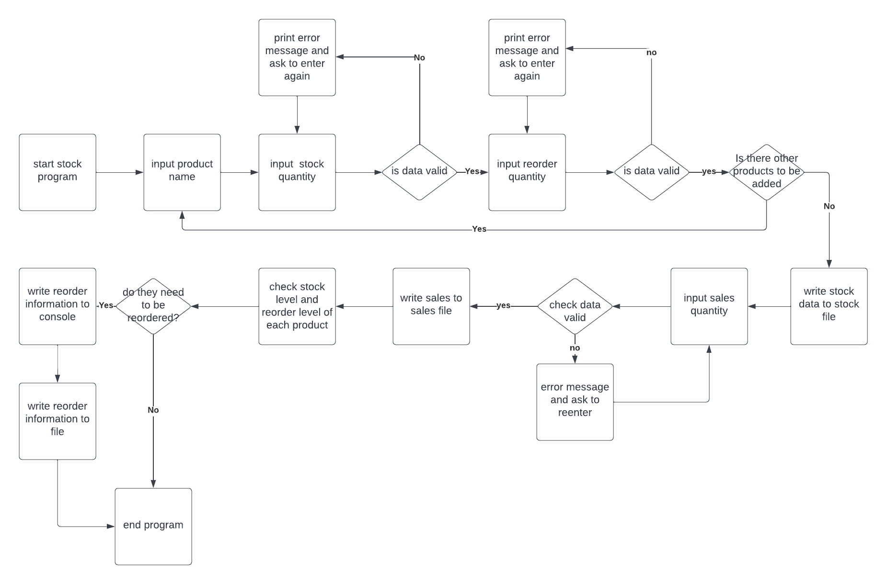

## Features

1 The initial screen welcomes the user to Stock program.  Let's get your stock ready! and then askes the user to enter the name of the product

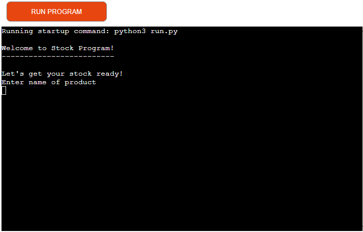

2 When the user enters the name of the product, the user is asked to enter the current quantity of the product in stock. The program checks that the user enters a valid number that is not negative.

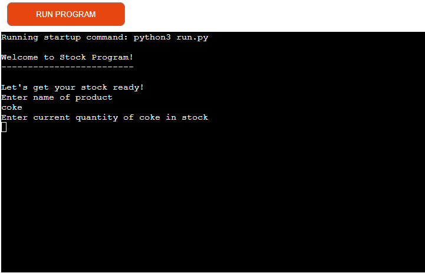

If the user enters data that is not a number an error message is printed and the user is asked to reenter the data.

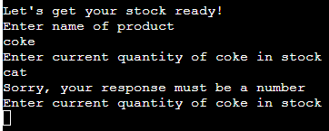

If the user enters a negative number an error message is printed and they are asked to enter the data again.

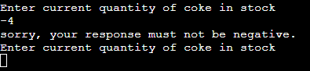

3 When the user enters the stock quantity of the product, they are then asked for the reorder quantity of the product. The program again checks the user enters a valid number that is not negative, if a number is not entered or a negative number is entered similar messages to above are printed and the user is asked to reenter the data.

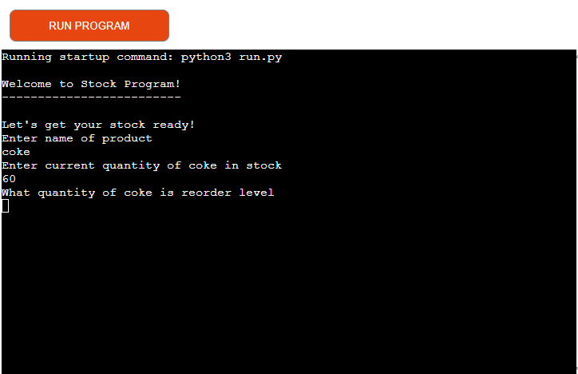

4 When the user enters the reorder quantity, the user is then asked if they want to enter a new stock.  

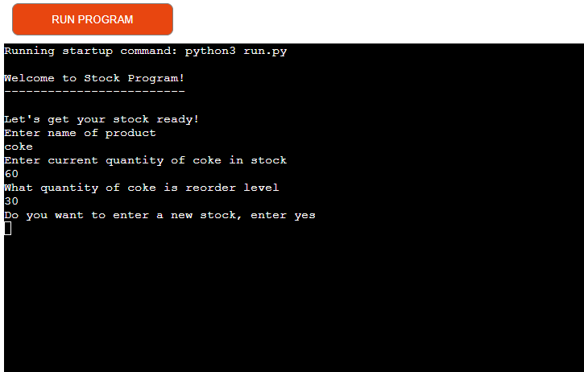

5 If they enter yes they are then asked for the name of the product and loop through asking them for the quantity and the reorder quantity for each product the user enters.

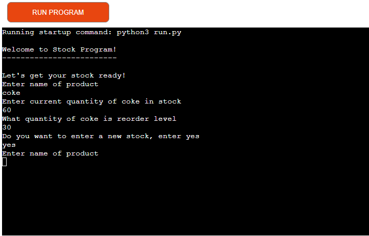

6 If the user answers no to do you want to enter a new stock, the program prints each product entered by the user, with the stock quantity.  It then asks the user what quantity of the first product entered did they sell.

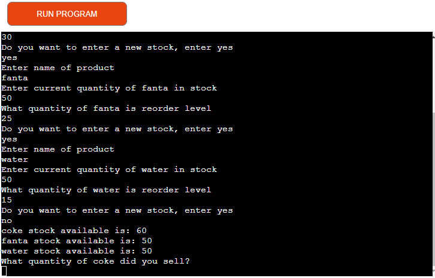

7 When the user enters the quantity of the product sold, the program checks that what the user enters is a valid number that is not negative. It also checks that the amount entered by the user is not greater than the stock of the product. The program prints "Sales of 40 of coke has been recorded."  This is to highlight to the user what quantity was entered for sales.

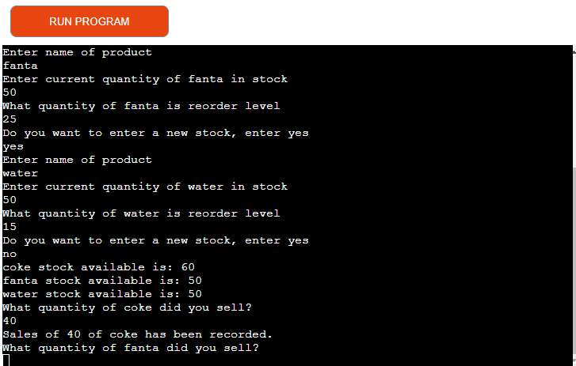

8 The program asks for sales quantity for each product entered by the user. 

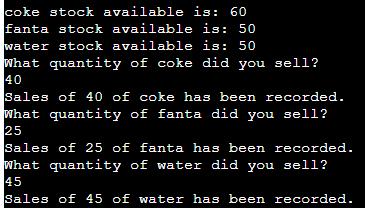

If anything other than a number is entered an error message is printed and the user is asked to reenter the quantity.

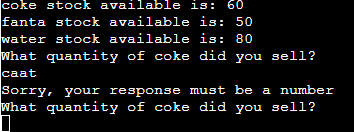

If a negative number is entered an error message is printed and the user is asked to reenter the quantity.

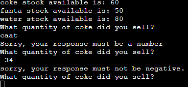

If the number entered is greater than the stock of that product, an error message is printed and the user is asked to reenter the quantity. The error message lets the user know the current stock and that the sales cannot be greater than that.

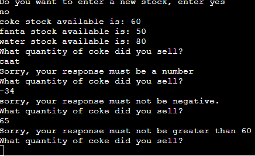

9 The program gets the stock and takes away the sales quantity, to give the new stock quantity. 
The program updates the quantity in the stock file and updates the is_audited field in the sales file to True.
It then checks the reorder quantity and if the new stock quantity is below the reorder quantity, the product is written to the console with the new stock quantity.  This is done for each product that needs to be reordered.

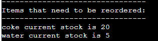

10 The products that need to be reordered are also written to a reorder file with the same information that is printed to the console.  This reorder comma delimited file has a date and time stamp so that if the program is run multiple times in a day the user will be able to tell the files appart. Finally the path to the comma delimited reorder file is printed to the console so that the user can get access to the file if needed.

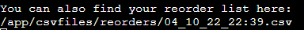

11 If none of the products need to be reordered, a message is printed to the console to say that nothing needs to be reordered. The file path to the reorder file is not shown in this instance.

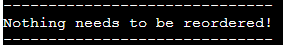

### Future Features

Allow the user to update the stock when they have reordered stock.

## Libraries used

I used csv library to read from and write to the comma delimited files (csv files).
I used the datetime library to put a date and time stamp on the reorder file.
I used the os library to give the user the path to the reorder comma delimited file.

## Testing and Validation

### PEP8

The python code was checked with PEP8 validator and passed with no errors found.

### Manual Testing

I checked that when I entered something that wasn't a number for the current stock quantity I got the error message.
I checked if I entered a negative number for stock quantity that I got the error message.
I checked if I didn't enter anything for stock quantity that I got an error message.
I checked that when i entered a non number or nothing for sales quantity, that I got an error message.
I checked that when I entered a negative number for sales quantity that I got an error message.
I checked when I entered a number greater than the current stock, that I got an error message.
I checked when I entered valid data that it was correctly printed to the console and also to the files.
I checked that the updated stock quantity was correct in the stock file.
I checked that the is_audited field was updated in the sales file.
I checked that the correct products and quantities were printed for reorder and also written to the reorder file.
I checked when there was nothing to be reordered that the correct message was printed to the console.
I checked that a reorder file was created with the correct date and time stamp.
I checked all of the above in the development environment and in the deployed site.

### Bugs found

I had hard coded the products file in the beginning for testing but when I then added that the user could input stocks I was never finding getting sales['item'] to equal stock['item'], I had to create a function to write a product list from the stocks file after the user has entered all thier products.

### Unfixed bugs

The date and time stamp on the reorder file is UTC timezone, Ireland is UTC +1. I thought I had coded something incorrectly but thankfully not. 

I have 2 nested for loops in my program and I researched but could not find another way to make this code simpler.

## Deployment

### How to deploy

To deploy this page to Heroku from my GitHub repository I followed the steps below:
- On the Heroku dashboard click New in the top right corner.
- From the drop down menu select Create New App.
- Enter your app name in the first field, the name must be unique, then select your region - Europe.
- Click on Create App.
- Once app is created you will see the overview panel of the application.
- Go to the settings tab
- Scroll down till you find Config Vars.
- Press the button Reveal Config Vars and enter PORT in the key field and 8000 in the value field.
- Scroll down to buildpacks.
- Click Add buildpacks and select Python and save.
- Select node.js and save.
- Python must be first and then node.js - order is important.
- Return back to the deploy tab
- from the deployment method select GitHub.
- you will be asked to connect your github account, confirm and proceed.
- search for your repository name and connect.
- you can choose to automatically deploy or manually deploy.  
- Automatic means each time you push to gitHub it creates your heroku terminal.  
- Manual option means you have to go into heroku each time you push changes to GitHub and press the deploy branch.

## Technologies used

- python
- code institute front-end built from the template
- heroku

## Credits

- Multiple youtube videos on how to read from and write to csv files
- love sandwiches for deployment process
- stackoverflow for validation in a function
- Lucidchart for my flow chart
- tinyPNG to compress images
- Okwudiri Okoro, my mentor for his help and for inspiring me to make my project better!
- My MSLETB cohort for their support and sharing knowledge 

