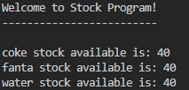
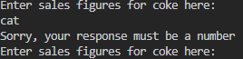
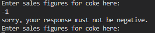
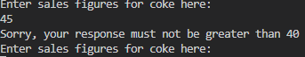
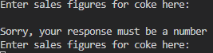
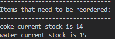
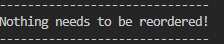

# STOCK PROGRAM

Stock is a simple program that allows the user to input the sales quantity for 3 products (coke, fanta and water) and the program writes this sales information to a sales file (comma delimited file).  A current stock file (also comma delimited) holds the current stock levels of the 3 products and also the reorder level.  The program updates the stock levels and writes the updated stock back to the stock file.  The program then checks if the products need to be reordered, whether the stock level is below the reorder level and if so the product and the current stock level is printed to the console and also written to a reorder file(csv).

The live link to Stock program is https://stock-dm.herokuapp.com/

## UX

### For user:

- to automate a stock process so that the user can easily see after inputting their sales if they need to reorder stock and how much stock they currently have. 

### The data model

#### Stock file: (this file is already set up)
- item:
- quantity:
- reorder-level

#### Sales file: (user inputs sales figures for each item)
- item:
- quantity:
- is-audited:

#### Reorder file: (this is calculated using the sales and stock files)
- item:
- current stock level:

## Flow Chart

To create the structure of the stock program I created a flow chart using Lucid Charts:

## Features

The initial screen welcomes the user and shows the current stock levels.

It then asks the user to input sales data for the items.  The program checks that the data entered is a non negative number and also that the sales figure is not greater than the stock levels i.e. 40.
So if the user types letters or anything that is not a number, they get this message back and asked to enter the sales figures again

If the user types a negative number, they get this message and asked to enter the sales figures again

If the user types a number greater than 40, (this is the initial stock of the items), they get this message and asked to enter the sales figures again

Even if nothing is entered or the user hits enter by accident, they get the following message

The program writes to a sales file.
A message comes up on the screen to tell the user that the sales file has been successfully updated.
It uses the sales figures and the stock figures to work out the current stock level. 
Another message comes up on the console to say that the stock quantity has been updated. 
It then checks the current stock level against the reorder level, and if the stock level is below the reorder level, the product and the current stock level is written to the console and also a reorder file.

If an item has stock below the reorder level then the item is written to the console with it's current stock

If all the items have stock above the reorder level then there is nothing to reorder.

### future features

Allow the user to update stock quantities when they reorder stock.

## Libraries used

I used csv library to read from and write to the comma delimited files (csv files).

## Testing and Validation

### PEP8

The python code was checked with PEP8 validator and passed with no errors found.

### Manual Testing

I checked with the user input that the data had to be a number, it had to be 0 or greater and not greater than 40 (as this was the initial stock level of all the products).

### Bugs found

### unfixed bugs

## Deployment

### How to deploy

To deploy this page to Heroku from my GitHub repository I followed the steps below:
- On the Heroku dashboard click New in the top right corner.
- From the drop down menu select Create New App.
- Enter your app name in the first field, the name must be unique, then select your region - Europe.
- Click on Create App.
- Once app is created you will see the overview panel of the application.
- Go to the settings tab
- Scroll down till you find Config Vars.
- Press the button Reveal Config Vars and enter PORT in the key field and 8000 in the value field.
- Scroll down to buildpacks.
- Click Add buildpacks and select Python and save.
- Select node.js and save.
- Python must be first and then node.js - order is important.
- Return back to the deploy tab
- from the deployment method select GitHub.
- you will be asked to connect your github account, confirm and proceed.
- search for your repository name and connect.
- you can choose to automatically deploy or manually deploy.  
- Automatic means each time you push to gitHub it creates your heroku terminal.  
- Manual option means you have to go into heroku each time you push changes to GitHub and press the deploy branch.

## Technologies used

- python
- code institute front-end built from the template
- heroku used to deploy

## Credits

- Multiple youtube videos on how to read from and write to csv files
- love sandwiches for deployment process
- stackoverflow for validation in a function
- Lucidchart for my flow chart
- tinyPNG to compress images

